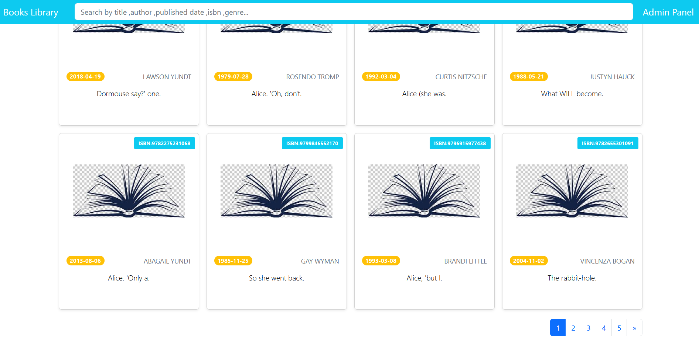
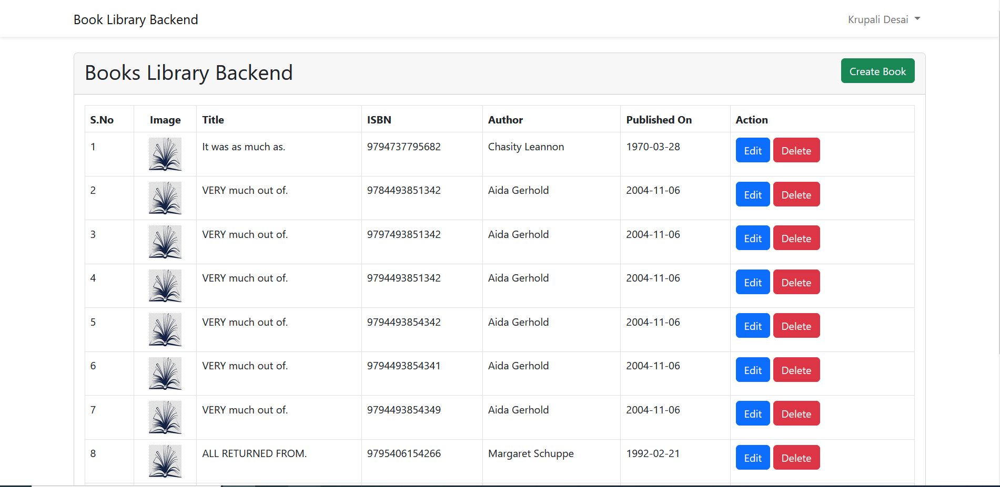

## Books Library

Books Library is a web application with backend and front end.
This app is based on PHP framework "Laravel" version 9.0 with using JS framework "Vue.js" to render frontend part using vite configuration.



### Installation

- Copy files on your server,
- Create database,
- Create a config file `.env` from `.env.example` and set database:
    ```
    DB_HOST=localhost
    DB_PORT=3306
    DB_DATABASE=books_library
    DB_USERNAME=root
    DB_PASSWORD=
    ``` 
- Go to root directory of this downloaded site,
- Run `npm install` (If command `npm` is not found please read https://docs.npmjs.com/downloading-and-installing-node-js-and-npm),
- Run `composer install` (If command `npm` is not found please read https://getcomposer.org/doc/00-intro.md),
- Run `php artisan key:generate` to generate `APP_KEY` in the config file,
- Run `php artisan config:cache` to clear cache in order to apply changes in the config file,
- Run `php artisan migrate` in order to create tables in your database,
- Run `php artisan db:seed` in order to insert books data into books tables in your database,
- Run `npm run dev` in order to intewgrate the vite config to laravel and vue js,
- Setup your http server to the folder `/public` manually or run `php artisan serve` to start it on address http://localhost:8000/.

### Usage

- Go to backend and register youself to upload or change the books data:

- The uploaded file will be processed by laravel queue job, so you need to keep run it on server by command `php artisan queue:work`,
- Result of the import from queue you can check in the log file `/storage/logs/laravel.log`.


Author: **Krupali Desai**
